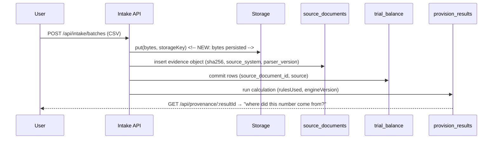
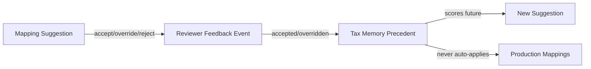
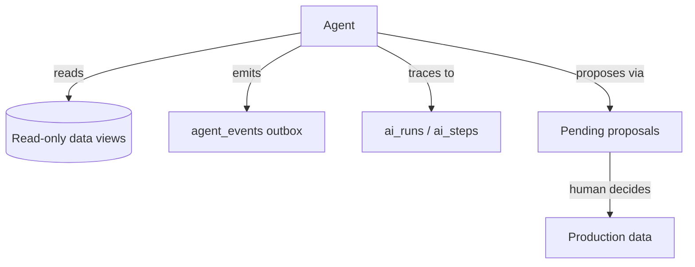

# Tax Intelligence Layer — Architecture

Status: **Foundational infrastructure**. Owner: Principal Engineer / AI Architect.
Scope: TaxPro is evolving from a tax calculation application into an AI-native Tax
Intelligence Platform. This document defines the layer that becomes the long-term
moat. It deliberately builds **no new tax features** — it builds the substrate that
every future feature (SME to Enterprise) sits on.

---

## 1. Design Principles

| Principle | Meaning | Enforced by |
|---|---|---|
| Deterministic | Identical inputs produce identical outputs | `@taxpro/tax-engine`, `rulesUsed`/`inputDataHash` on runs, stable hashing (`eve/hash.ts`), sorted iteration in calculators |
| Explainable | Every number answers "where did this come from?" | Provenance API (`/api/provenance/:resultId`) + persisted `data_lineage_edges` |
| Auditable | Nothing is silently mutated or deleted | Append-only event ledgers with DB triggers; DELETE denied by RLS default-deny |
| Modular | Domain / application / infrastructure / presentation are separable | `src/modules/*` (domain+app), `src/lib/*` (infra), routes are thin |
| Governed | Humans approve; AI advises | Suggestions are `pending` until decided; AI never writes accounting data |
| Versioned | History is never overwritten | `is_current` doc versions, `supersedes_*` chains, per-version rules/mappings |

---

## 2. Layered Architecture & Folder Structure

```
apps/api/src
├── index.ts                      # Presentation: HTTP bootstrap + route mounting
├── modules/                      # Bounded contexts (domain + application per module)
│   ├── provenance/               # NEW — knowledge graph read side
│   │   ├── provenance.service.ts # Application: graph walk / evidence story
│   │   ├── provenance.routes.ts  # Presentation: thin HTTP handlers
│   │   └── provenance.service.test.ts
│   ├── intelligence/             # NEW — evidence/agent infrastructure
│   │   ├── evidence.service.ts   # Application: persist upload as evidence object
│   │   ├── agent-events.ts       # Application: structured agent event emitter
│   │   └── ...
│   ├── intake/                   # Trial balance ingestion (existing)
│   ├── provision/                # Run orchestration + calculation (existing)
│   ├── workbench/                # Document-driven calculation (existing)
│   ├── mapping/                  # Tax mappings (existing)
│   ├── documents/                # Evidence objects (existing)
│   └── ...                       # periods, review, handoff, export, integrations
├── eve/                          # AI substrate (existing, extended)
│   ├── agent.ts                  # NEW — defineAgent / runAgent / read-only guard
│   ├── model-client.ts           # Single LLM entry point (existing)
│   ├── trace-store.ts            # ai_runs/ai_steps persistence (existing)
│   └── hash.ts                   # stable hashing (existing)
├── db/schema/                    # Infrastructure: Drizzle schemas (see §4)
├── db/migrations/                # Infrastructure: additive SQL migrations (see §12)
├── lib/
│   ├── lineage/                  # NEW — shared lineage edge writer
│   ├── storage/                  # Evidence bytes (existing)
│   └── middleware/               # auth, rbac, errors, rate-limit (existing)
```

Rules:
- **Controllers are thin.** No business logic in routes beyond validation + calling a service.
- **Repositories are `tx`-scoped Drizzle queries** inside services; no raw SQL in routes.
- **Domain events are persisted, never thrown away** (see §8).

---

## 3. Domain Model — Node Inventory

| Node | Table | Exists |
|---|---|---|
| Tenant / User | `tenants`, `users` | ✅ |
| Legal Entity | `entities` (+ `entity_groups`, `parent_entity_id`) | ✅ |
| GL Account | `accounts` | ✅ |
| Trial Balance | `trial_balance` (debit/credit/balance, `source`, `source_document_id`) | ✅ |
| Source Document | `source_documents` (evidence object, §5) | ✅ |
| Import Batch / Row / Event | `import_batches`, `import_batch_rows`, `import_batch_events` | ✅ |
| Tax Mapping / Proposal | `tax_mappings`, `mapping_proposals` | ✅ |
| Tax Memory / Suggestions | `tax_memory_precedents`, `mapping_suggestions` | ✅ |
| Review Item (+ events) | `review_items`, `review_item_events` | ✅ |
| Adjustment | `tax_adjustments` (`supersedes_adjustment_id`, `evidence_document_id`) | ✅ |
| Provision Run / Result / Event | `provision_runs`, `provision_results`, `provision_events` | ✅ |
| UK Rules | `uk_rules` (versioned, approved) | ✅ |
| AI Runs / Steps | `ai_runs`, `ai_steps` | ✅ |
| Feedback | `reviewer_feedback_events` | ✅ |
| Knowledge Graph edge | `data_lineage_edges` | ✅ |
| Evidence edge | `evidence_links` | ✅ |
| **Fixed Assets** | — | ⏳ modelled as `placed_in_service_date` + `TEMP_DEPRECIATION` mapping; dedicated table is a roadmap item |
| **Journals** | — | ⏳ generated in `provision_results.detail.journalEntries`; persistence is a roadmap item |
| **Workpapers** | — | ⏳ generated exports + `workpaper` document type; persistence is a roadmap item |
| **Agent Events** | `agent_events` | 🔨 migration 0019 |

---

## 4. Knowledge Graph Schema

### 4.1 Edge table (existing, canonical)

```sql
data_lineage_edges(
  id, tenant_id,
  source_kind varchar(40), source_id uuid,
  target_kind varchar(40), target_id uuid,
  relation varchar(40),
  metadata jsonb, created_at,
  UNIQUE (tenant_id, source_kind, source_id, target_kind, target_id, relation)
)
```

### 4.2 Relation vocabulary

```mermaid
graph LR
  E[Entity] -->|owns| A[Account]
  E -->|has period| P[Accounting Period]
  A -->|appears_in| TB[Trial Balance]
  TB -->|committed_from| R[Import Batch Row]
  B[Import Batch] -->|contains| R
  SD[Source Document] -->|source_of| B
  U[User] -->|uploaded| SD
  TB -->|used_balance| PR[Provision Result]      <!-- NEW: calc-time edge -->
  RUN[Provision Run] -->|produced| PR             <!-- NEW: calc-time edge -->
  PR -->|adjusted_by| ADJ[Tax Adjustment]
  ADJ -->|supported_by| SD
  A -->|mapped_to| TM[Tax Mapping]
  TM -->|recalled_from| PRE[Tax Memory Precedent]
  PRE -->|cited_by| SUG[Mapping Suggestion]
  SUG -->|decided_by| U
  IT[Review Item] -->|flagged_by| A
  RUN -->|flagged_by| IT
```

**Two edge sources — both queryable:**
1. **Persisted edges** (`data_lineage_edges`): written at intake commit
   (`import_batch→row` `contains`, `row→trial_balance` `committed_to`,
   `document→batch` `source_of`) and at calculation time (`run→result` `produced`,
   `result→trial_balance` `used_balance` — migration-0019-era feature, §12).
2. **Derived edges** (FK walks): the provenance service falls back to foreign keys
   for records created before graph edges existed, so every trace is derivable.

### 4.3 Queryability

Every node and edge is queryable by:
- **Node**: `GET /api/provenance/:resultId`, `GET /api/intake/lineage/account/:accountId`,
  `GET /api/intake/lineage/run/:runId`
- **Edge**: `GET /api/provenance/document/:documentId` (evidence story)
- **Raw**: `GET /api/intake/lineage/account/:accountId` returns `{nodes, edges}`.

---

## 5. Evidence Graph Schema

Every uploaded document is an **evidence object** with a verifiable identity and a
full story.

### 5.1 `source_documents` (extended in migration 0019)

| Column | Purpose |
|---|---|
| `id`, `tenant_id` | identity + tenancy |
| `filename`, `mime_type`, `size_bytes` | artefact metadata |
| `storage_key` | pointer to immutable bytes (storage backend) |
| `sha256` | content fingerprint (immutability proof) |
| `source_system` 🔨 | where it came from (`manual_upload`, `csv_import`, `xero`, `qbo`, `netsuite`, `api`) |
| `parser_version` 🔨 | which parser produced the structured data (`intake-csv-v1`, …) |
| `ocr_version` 🔨 | which OCR/extraction pipeline version ran (`interfaze-v1`, …) |
| `extraction_status` | `not_required` / `pending` / `extracted` / `failed` |
| `uploaded_by_user_id`, `created_at`, `updated_at` 🔨 | who, when |
| `version`, `parent_document_id`, `is_current` | immutable versioning — replace creates a new row |

### 5.2 Evidence links (existing)

```sql
evidence_links(id, tenant_id, subject_kind, subject_id, document_id, evidence_role,
               note, created_by_user_id, created_at,
               UNIQUE (tenant, subject_kind, subject_id, document_id))
-- evidence_role: source | supporting | confirmation | correction
```

### 5.3 The Evidence Story



UI contract (future): one call `GET /api/provenance/:resultId` renders a vertical
story: **Result → Adjustment → Evidence → Document → Upload → Reviewer → History**.

---

## 6. Provenance API Contracts

### `GET /api/provenance/:resultId`

```jsonc
{
  "result": {
    "id": "…", "period": "2026-03-31", "status": "draft",
    "summary": { "bookIncome": "…", "currentTaxExpense": "…", "taxPayable": "…" },
    "calculation": {
      "engineVersion": "tax-engine-0.1.0",
      "rulesUsed": [ { "ruleKey": "uk.rates.v1", "version": 1, "effectiveFrom": "2026-01-01" } ],
      "inputDataHash": "sha256…",
      "mappingVersionHash": "sha256…",
      "confidence": 1.0, "deterministic": true,
      "trace": { "temporaryDifferences": [ { "accountId": "…", "difference": "…", "timingCategory": "…" } ] }
    }
  },
  "run": { "id": "…", "status": "calculated", "mode": "direct", "createdBy": { "userId": "…" } },
  "inputs": [ { "kind": "trial_balance", "id": "…", "label": "Account 1234 — Rent",
                "balance": "4000.00", "period": "2026-03-31" } ],
  "adjustments": [ { "id": "…", "amount": "999.99", "reason": "…",
                      "status": "approved", "evidence": { "documentId": "…", "filename": "…" } } ],
  "evidence": [ { "document": { "id": "…", "filename": "tb-fy2026.csv", "sha256": "…",
                                 "sourceSystem": "csv_import", "parserVersion": "intake-csv-v1",
                                 "uploadedBy": { "userId": "…", "email": "…" },
                                 "uploadedAt": "…", "extractionStatus": "extracted" },
                   "links": [ { "role": "source", "subjectKind": "import_batch", "subjectId": "…" } ] } ],
  "history": [ { "eventType": "batch.validated", "occurredAt": "…", "actorType": "system" },
               { "eventType": "calculation.completed", "occurredAt": "…", "actorType": "user" } ]
}
```

### `GET /api/provenance/document/:documentId`

```jsonc
{ "document": { …evidence object… },
  "uploader": { "userId": "…", "email": "…", "role": "preparer" },
  "derived": [ { "kind": "trial_balance", "ids": [ "…" ] }, { "kind": "import_batch", "ids": [ "…" ] } ],
  "links": [ …evidence_links… ],
  "history": [ …source-document/version events… ] }
```

Response envelope for both: `{ provenance: <above>, generatedAt }`. Errors:
`404` unknown id / cross-tenant id (RLS fails closed), `403` for `client_readonly`
on history detail if policy requires (default: read access for all roles ≥ auditor).

---

## 7. Deterministic Rule Engine Contract

**LLMs may** explain, summarize, classify. **LLMs must NOT** determine tax law,
invent calculations, or modify financial data.

Every result carries (assembled by the provenance layer):

| Field | Source |
|---|---|
| `ruleId` / `ruleVersion` | `provision_runs.rulesUsed` (resolved from approved `uk_rules`) |
| `engineVersion` | `provision_runs.engine_version` |
| `evidenceUsed` | `source_document_id` + `data_lineage_edges` + `evidence_links` |
| `calculationTrace` | `provision_results.detail.lineItems` (+ future per-line trace) |
| `confidence` | `1.0` for engine math; suggestion confidence for AI-classified mappings |

Calculation entry points (`runProvisionMath`, `runWorkbenchCalculationJob`) already
fail closed when rules are unresolved and pin every input hash — the provenance
layer only needs to **surface** what the engine already guarantees.

---

## 8. Domain Events

| Event ledger | Append-only? | Writes |
|---|---|---|
| `provision_events` | ✅ trigger + grants | run lifecycle, calculation, mapping overrides, approvals, filing, `ai.*` |
| `import_batch_events` | ✅ trigger | batch created/validated/failed/committed/superseded/suggestion decisions |
| `review_item_events` | ✅ trigger | review item lifecycle |
| `reviewer_feedback_events` | ✅ trigger | accept/reject/override/correct decisions (learning input) |
| `external_filings` | ✅ trigger | filing register |
| `agent_events` 🔨 | ✅ trigger | structured agent→agent messages (outbox) |
| `ai_runs` / `ai_steps` | mutable (status transitions only) | agent execution traces |

Event envelope (consistent everywhere): `{ eventType, actorType: user|agent|system,
actorUserId?, actorAgentId?, occurredAt, reason?, beforeState?, afterState?, metadata? }`.

---

## 9. Tax Memory & Learning System



- **Memory stores**: `tax_memory_precedents` (approved treatments, entity/group scope,
  effective-period scoped, jurisdiction-scoped), `classification_patterns`
  (override patterns → confidence boosts), `mapping_suggestions` (decisions).
- **Adjustments** are learned too 🔨: `POST /api/intake/adjustments/:id/approve|reject`
  writes immutable `reviewer_feedback_events` (subjectKind `tax_adjustment`); the
  adjustment itself is versioned via `supersedes_adjustment_id` — history never
  overwritten.
- **Versioning**: rules, mappings, adjustments and documents are versioned by
  supersede chains or `version` + `is_current`. Memory is versioned by
  `effective_from/effective_to` + `created_at` (freshness-decayed scoring).
- **Never automatically modify production mappings**: suggestions are `pending`
  until a human decides; AI output is advisory (`source='ai'`, persisted as
  pending); deterministic scores are explainable (`similarity/scope/vintage`).

---

## 10. AI Agent Framework



- **Agents are registered definitions** (🔨 `eve/agent.ts`): `{ name, workflowName,
  promptVersion, description, capabilities }`. No ad-hoc LLM calls.
- **Read-only enforcement**: `runAgent` wraps the transaction in a proxy that only
  permits `select`; any write through the agent handle is rejected at runtime
  (`AgentWriteDeniedError`). Agents propose (`mapping_suggestions`, review items,
  feedback events); they never mutate accounting data.
- **Communication via structured events**: `emitAgentEvent` writes to
  `agent_events` (append-only, RLS-scoped). Consumers subscribe by `event_type`
  (future: BullMQ fan-out; today: queryable outbox).
- **Tracing**: every agent run opens an `ai_runs` row; every tool/step is an
  `ai_steps` row with `input_json/output_json` — the event log doubles as the
  audit trail for what the AI did and why.
- **Agent roster** (existing + registered): Document Agent (🔨 registration),
  Evidence Agent (🔨), Mapping Agent (`mapping-agent` / auto-mapping worker),
  Reconciliation Agent (roadmap), Review Agent (roadmap), Provision Agent
  (`eve_provision_analysis`), Workpaper Agent (roadmap).

---

## 11. Enterprise Architecture

| Requirement | Mechanism |
|---|---|
| Multi-tenancy | `tenant_id` on every row + RLS `app_current_tenant_id()` (fail-closed NULL), `withTenantContext` transaction-local GUC |
| RBAC | JWT roles `admin/preparer/reviewer/partner/client_readonly/auditor`, hierarchy middleware, per-route guards |
| Audit logs | append-only event ledgers (trigger-enforced) + `auditSensitiveOp` |
| Versioning | supersede chains (`parent_run_id`, `supersedes_*`), `version`/`is_current`, rules `(tenant, rule_key, version)` |
| Immutable events | DB triggers raise on UPDATE/DELETE of ledger rows; grants are SELECT/INSERT only |
| Soft deletes | `is_active`, `is_inactive`, status transitions; physical DELETE denied by RLS default-deny |
| No breaking migrations | additive-only SQL, `IF NOT EXISTS`, grants in-migration, rollback blocks |

---

## 12. Migration Plan

| # | Tag | Contents |
|---|---|---|
| 0017 | `enterprise_intake` | intake tables, RLS, events ledger, `rule_version_hash` (applied) |
| 0018 | `intake_delete_policies` | DELETE policies on evidence_links + tax_memory_precedents (applied) |
| 0019 | `intelligence_layer` | `source_documents` + `source_system`, `parser_version`, `ocr_version`, `updated_at`; `import_batches` + `storage_key`, `parser_version`; `agent_events` table (append-only, RLS, grants) (applied) |
| 0020 | `adjustment_review` | `tax_adjustments` + `status`/`decided_by_user_id`/`decided_at`/`decision_reason` + status index (applied) |
| 0021+ | `calc_lineage` | (same migration family) — no-op if edges are written by code; reserved for per-line calculation traces |

All additive; `CREATE TABLE IF NOT EXISTS` / `ADD COLUMN IF NOT EXISTS`; grants and
rollback blocks per convention.

---

## 13. Implementation Roadmap

1. ✅ **0019 migration + evidence persistence** — every intake upload becomes a
   real evidence object (bytes + metadata); `persistIntakeEvidence` in
   `modules/intelligence/evidence.service.ts` writes bytes → `source_documents`
   → batch auto-link. *Done first: everything else depends on it.*
2. ✅ **Calc-time lineage edges** — `produced` / `used_balance` written at both
   calculation paths (`modules/provision/provision.routes.ts`,
   `modules/workbench/operations.ts`) via `lib/lineage/edges.ts`
   (idempotent `ON CONFLICT DO NOTHING`).
3. ✅ **Provenance API** — `GET /api/provenance/results/:resultId` +
   `GET /api/provenance/documents/:documentId` + `GET /api/provenance/agents`
   (`modules/intelligence/provenance.*`).
4. ✅ **Agent framework + agent_events** — `eve/agent.ts` (`defineAgent`
   registry, `emitAgentEvent`, `runReadOnly` guard, `recordAgentStep`,
   `runAgent`), outbox writes from the intake agent / platform / learning
   system, agent roster in `modules/intelligence/agents.ts`.
5. ✅ **Adjustment feedback** — `POST /api/intake/adjustments/:id/approve` /
   `/reject` + immutable `reviewer_feedback_events` + `learning_system` agent
   events (migration 0020).
6. Web UI: "Where did this number come from?" viewer (future).
7. Reconciliation agent, workpaper persistence, journal persistence (future).

Verified: `phase-f-intelligence.test.ts` 11/11 (evidence roundtrip, calc-time
edges, provenance stories, agent registry, read-only guard, adjustment review,
cross-tenant 404); full API suite 391/391 (32 files); monorepo lint 5/5;
`tsc` clean (api + web).

## 14. Testing Strategy

- **Pure/unit**: graph walkers with synthetic edge sets; agent read-only guard;
  event envelope validation; deterministic hashing (already covered by `phase-e-*`).
- **Integration (real Postgres, tenant-scoped)**: `phase-f-intelligence.test.ts` —
  upload → evidence object persisted; calculate → edges exist; provenance walk
  returns the full story; agent event outbox append-only (UPDATE/DELETE rejected);
  adjustment approve/reject feedback events; cross-tenant provenance → 404.
- **Regression**: full `vitest run` suite (380+ tests) + `npm run lint` (tsc both workspaces).

## 15. Performance Considerations

- Provenance walks are bounded: result → run (1), → accounts (n, from detail),
  → evidence (m), → history (k). Each is an indexed PK/FK lookup; total latency
  target < 50 ms.
- `data_lineage_edges` unique constraint makes edge writes idempotent and cheap
  (`ON CONFLICT DO NOTHING`).
- Edge writes at calc time are batched per result; `used_balance` edges are
  capped to tax-relevant (temporary-difference) accounts, not the full ledger.
- All reads go through RLS-filtered queries with existing indexes
  (`idx_lineage_source`, `idx_lineage_target`, `idx_evidence_links_subject`).
- Event ledgers grow unbounded by design; paginate by `occurred_at`, archive to
  cold storage at enterprise tier (roadmap).

## 16. Security Considerations

- **RLS fail-closed**: unknown/empty tenant → zero rows; cross-tenant IDs are
  indistinguishable from missing (404).
- **Append-only by trigger AND by grants** — defense in depth; runtime role has
  no table ownership and NOBYPASSRLS.
- **Agent writes blocked by proxy** at runtime, not by convention.
- **Evidence bytes**: stored under tenant-scoped keys with traversal guards
  (LocalStorageBackend rejects `..`/`:`/`\`); downloads re-check RLS before
  streaming; exports ship hashes only.
- **Secrets**: model keys and connection tokens live in env; never in rows
  returned by provenance (strip `access_token`/`consumer_secret` from any
  integration-derived output).
- **Audit**: sensitive ops (approve, override, file, lock) write `auditSensitiveOp`
  with actor role + request id.
